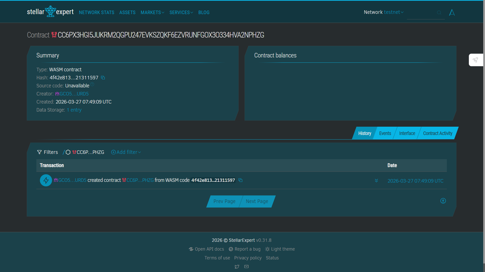

# 🌟 Soroban Smart Contract Project (Stellar)

## 📌 Project Description

This repository contains a modular Soroban smart contract project built on the Stellar blockchain. It follows the recommended workspace structure for developing, testing, and deploying multiple smart contracts efficiently.

The project is designed to help developers quickly bootstrap Soroban-based decentralized applications (dApps) using Rust.

---

## ⚙️ What It Does

* Provides a structured environment for building Soroban smart contracts
* Includes a sample `hello_world` contract for learning and testing
* Supports multiple contracts within a single workspace
* Enables seamless compilation, testing, and deployment to Stellar networks

---

## 📁 Project Structure

```text
.
├── contracts
│   └── hello_world
│       ├── src
│       │   ├── lib.rs
│       │   └── test.rs
│       └── Cargo.toml
├── Cargo.toml
└── README.md
```

### 🔹 Structure Breakdown

* **contracts/**
  Contains all smart contracts. Each contract lives in its own folder.

* **hello_world/**
  A sample contract to demonstrate basic Soroban functionality.

* **lib.rs**
  Core smart contract logic.

* **test.rs**
  Unit tests for contract functionality.

* **Cargo.toml (root)**
  Workspace configuration for managing dependencies across contracts.

* **Cargo.toml (contract-level)**
  Defines dependencies and settings specific to each contract.

---

## ✨ Features

### 🧩 1. Modular Contract Architecture

* Easily add multiple contracts
* Each contract is isolated and independently manageable

---

### ⚡ 2. Workspace-Based Dependency Management

* Shared dependencies via root `Cargo.toml`
* Cleaner and scalable project setup

---

### 🧪 3. Built-in Testing

* Each contract includes test files
* Enables local testing before deployment

---

### 🚀 4. Ready for Deployment

* Compatible with Soroban CLI
* Easily deployable to Stellar testnet or mainnet

---

### 📦 5. Extensible for Frontend Integration

* Frontend apps (React, Next.js, etc.) can be added at the root level
* Supports full-stack Web3 development

---

## 🛠️ Tech Stack

* **Rust**
* **Soroban SDK**
* **Stellar Blockchain**

---

## 🚀 Getting Started

### 1. Install Dependencies

* Install Rust
* Install Soroban CLI

---

### 2. Build Contracts

```bash
soroban contract build
```

---

### 3. Run Tests

```bash
cargo test
```

---

### 4. Deploy Contract

```bash
soroban contract deploy \
  --wasm target/wasm32-unknown-unknown/release/hello_world.wasm \
  --source <your-identity> \
  --network testnet
```

---

### 5. Invoke Contract

```bash
soroban contract invoke \
  --id <contract-id> \
  --fn hello
```

---

## 💡 Use Cases

* Learning Soroban smart contract development
* Building decentralized applications (dApps)
* Experimenting with blockchain-based logic
* Hackathon projects and prototypes

---

## 🔮 Future Improvements

* Add advanced contracts (e.g., Knowledge Base, Voting, DAO)
* Integrate frontend (React + Stellar SDK)
* Add authentication using wallets
* Deploy to mainnet

---

## 🤝 Contribution

Contributions are welcome! Feel free to fork the repo and submit pull requests.

---

## 📜 License

MIT License


